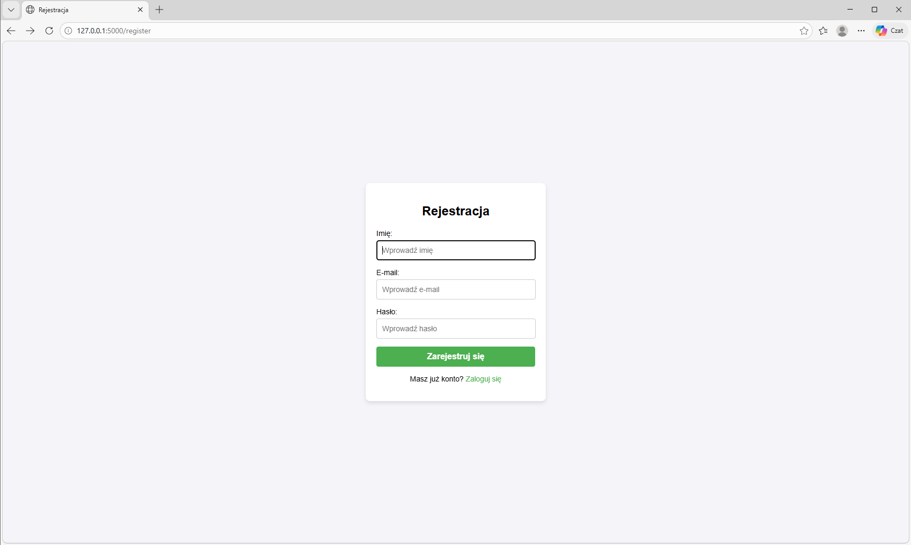

# 📝 Notes Manager Web App – Flask & MySQL



A full-stack web application for managing personal notes, built with Python, Flask, SQLAlchemy, and MySQL. Designed with Object-Oriented principles and secure user authentication, this project demonstrates practical full-stack development skills suitable for junior-to-mid web developer roles.

---

## 📖 Project Overview

This web application allows multiple users to:

- Register and log in securely
- Create, edit, and delete personal notes
- Persist notes in a relational MySQL database
- View all saved notes with a clean and intuitive interface
- Receive immediate feedback through flash messages

The application emphasizes security, clean architecture, and user experience, making it a professional-grade learning project.

---

## 🚀 Key Features

- 🔐 **Secure Authentication** – Passwords hashed with Werkzeug, session management for logged-in users
- 📝 **CRUD Operations** – Full Create, Read, Update, Delete functionality for notes
- 💾 **Persistent Storage** – MySQL database integration with SQLAlchemy ORM
- 👥 **Multi-User Support** – Each user sees only their own notes
- ⚡ **Interactive UI** – Flash messages for user feedback and smooth navigation
- 🔄 **Note Management** – Edit and delete functionality with proper session handling

---

## 🛠️ Technologies & Skills Demonstrated

| Technology | Usage |
|---|---|
| Python 3 | Backend logic, routing, OOP |
| Flask | Web framework for routing, templates, session management |
| SQLAlchemy ORM | Object-relational mapping with MySQL |
| Werkzeug | Secure password hashing |
| MySQL | Relational database for persistent storage |
| HTML / CSS / Dynamic templating and frontend integration |

---

## ▶️ Setup & Running the Project

### 1. Clone the repository
```bash
git clone https://github.com/PawelK123/Notes_manager_web_app.git
cd Notes_manager_web_app
```

### 2. Install dependencies
```bash
pip install -r requirements.txt
```

### 3. Configure the database

- Ensure a MySQL database named `aplikacja` exists
- Update `app.config['SQLALCHEMY_DATABASE_URI']` in `app.py` with your MySQL credentials if needed

### 4. Run the app
```bash
python app.py
```

### 5. Access the web app
```
http://127.0.0.1:5000/
```

---

## 📂 Project Structure
```
/Notes_manager_web_app
├── app.py           # Main Flask application
├── templates/       # HTML templates with JS: login, register, notes, edit_note, welcome
├── static/          # CSS
├── requirements.txt # Python dependencies
```

---

## 🧠 Learning Outcomes

- Designing full-stack web applications with Flask
- Implementing secure authentication and session management
- Building CRUD functionality with SQLAlchemy and MySQL
- Handling user input and validation in web forms
- Structuring multi-user web applications with clean OOP principles
- Using flash messages and dynamic templates to improve UX

---


